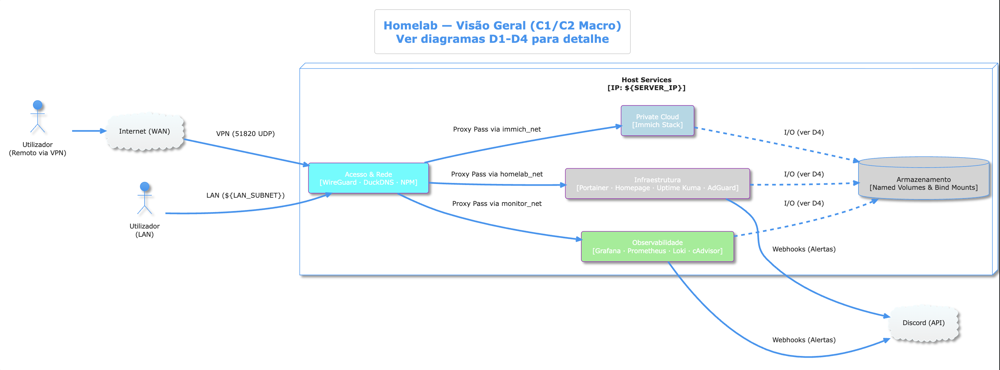
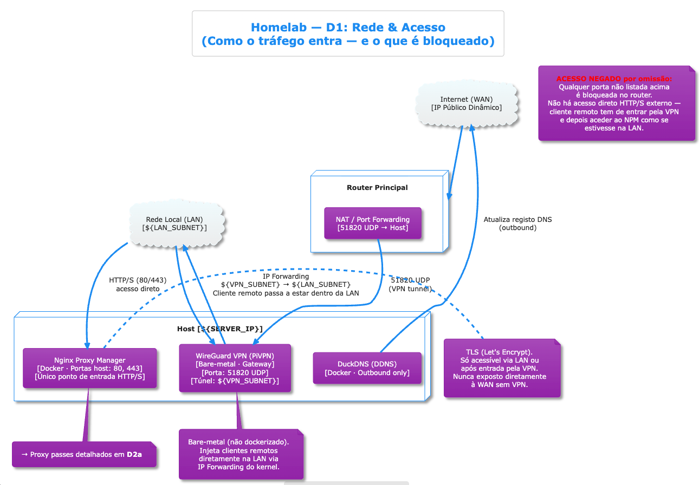
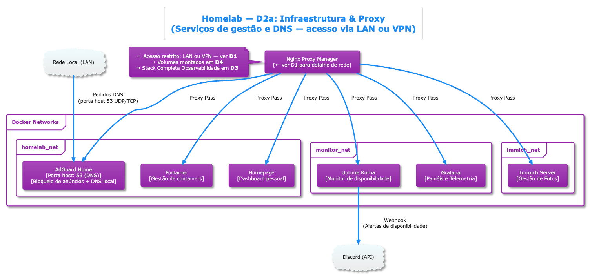
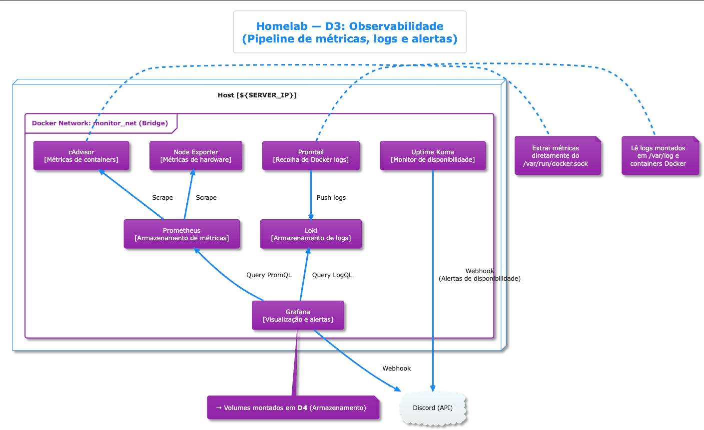
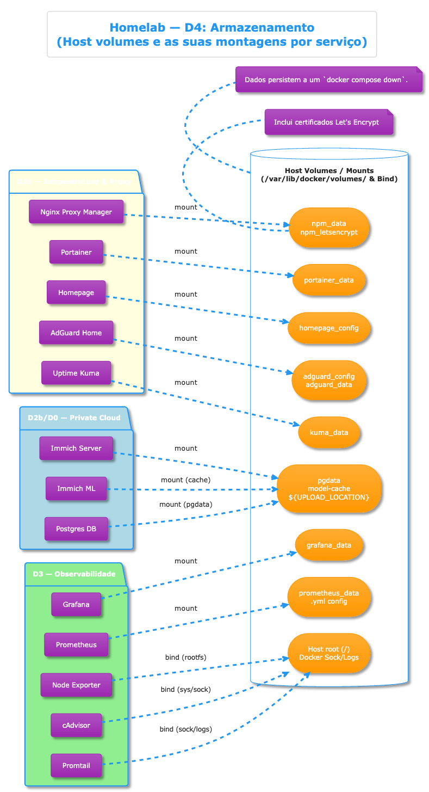

# 📐 Architecture Documentation (C4 Model)

This directory contains the PlantUML source files (`.puml`) and their exact visual representations. It maps out the entire Homelab architecture using the C4 model concepts, scaling from the macro overview down to how Docker volumes are mounted.

---

## 🌍 D0: Macro Overview
Shows the big picture interfaces, the outer VPN entry point, and the division between macro-services.

---

## 🔒 D1: Network & Access
Details how traffic enters the network and what boundaries are enforced by the router and WireGuard VPN tunnel.

---

## 🚦 D2a: Infrastructure & Proxy
Breaks down the container orchestration networks, the proxy routing rules defined in Nginx Proxy Manager, and internal DNS resolution.

---

## 📊 D3: Observability
Details the telemetry pipeline including hardware monitoring, container extraction, scaling, and the visualization & alerting tools.

---

## 💾 D4: Storage & Volumes
Describes the precise mapping of Docker's logical named volumes and explicit host bind mounts to container internal paths.

---
*Note: Diagrams generated from the `*.puml` source files in this folder.*
