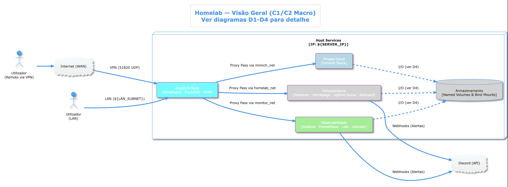
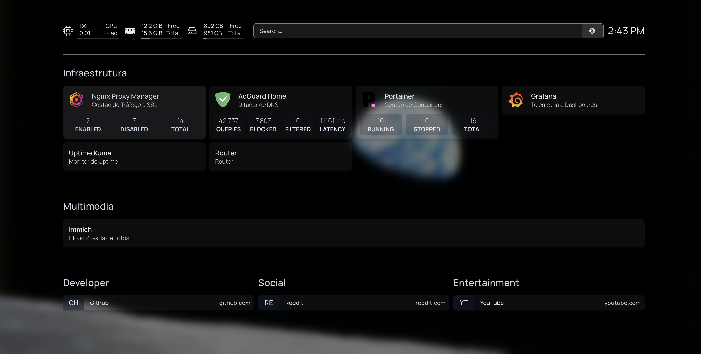
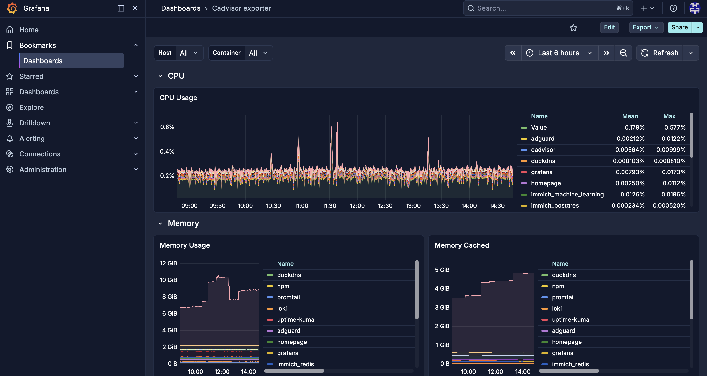

# 🚀 Homelab & Private Cloud Infrastructure



This repository contains the infrastructure configurations, Docker Compose files, and architecture documentation for my personal Homelab. It serves as a self-hosted private cloud, focusing on **Security**, **Observability/Reliability**, and **Infrastructure as Code (IaC)**.

## ✨ Key Highlights

* **Architecture Documentation (C4 Model):** Entire infrastructure is mapped out using the C4 model (PlantUML), detailing network boundaries, proxy routing, and data storage.
* **Security-First approach:** No services are exposed directly to the public internet. Access is strictly managed via a **WireGuard VPN** tunnel, injecting remote clients into the internal LAN. Local DNS and ad-blocking are handled by **AdGuard Home**.
* **Advanced Observability Stack:** Full telemetry pipeline utilizing **Prometheus** (time-series metrics), **Loki & Promtail** (log aggregation), **cAdvisor** (container metrics), and **Grafana** for visualization and Discord webhook alerts.
* **Private Photo Cloud:** Complete **Immich** stack deployment utilizing internal Machine Learning models for facial/object recognition and `pgvecto-rs` PostgreSQL databases.

## 🛠️ Technology Stack

| Category | Tools |
| :--- | :--- |
| **Reverse Proxy & Network** | Nginx Proxy Manager, WireGuard, DuckDNS |
| **Observability** | Grafana, Prometheus, Loki, Promtail, Node Exporter, cAdvisor |
| **DNS & Security** | AdGuard Home |
| **Self-Hosted Services**| Immich (Photo/Video Management) |
| **Management & Dashboards** | Portainer, Homepage, Uptime Kuma |

## 📸 Showcase

### Command Center (Homepage)


### Telemetry & Monitoring (Grafana)


## 📁 Repository Structure

```text
📦 homelab
 ┣ 📂 Documents/            # PlantUML C4 Model architecture diagrams 
 ┣ 📂 homepage_config/      # Declarative configuration for the landing dashboard
 ┣ 📂 immich/               # Private cloud photo stack (App, ML, Redis, Postgres)
 ┣ 📂 monitor/              # Observability pipeline (Grafana, Prom stack)
 ┣ 📂 uptime-kuma/          # Availability monitoring
 ┣ 📜 docker-compose.yml    # Root network, proxy, and management layer
 ┗ 📜 .env.example          # Template for environment variables (Secrets)
```

## 🚀 Deployment

1. Clone the repository.
2. Secure your environment by duplicating the `.env.example` to `.env` and populating it with your secure variables.
3. Bring up the foundational layer:
   ```bash
   docker compose up -d
   ```
4. Bring up independent stacks (`monitor`, `immich`, `uptime-kuma`) as needed:
   ```bash
   cd monitor && docker compose up -d
   ```

---
*Created and maintained as a showcase of Systems Administration, DevOps, and Platform Engineering skills.*
